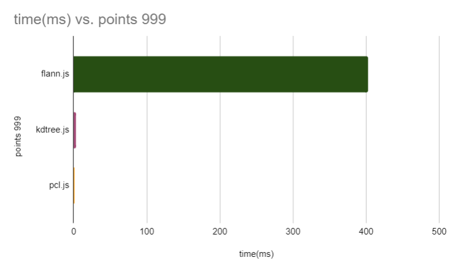
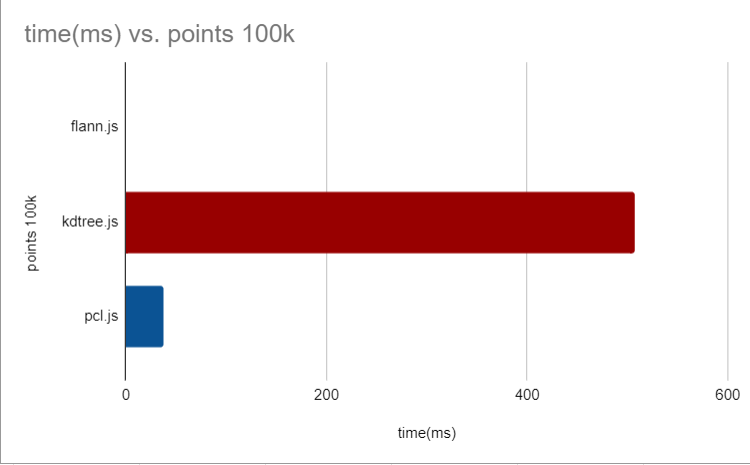

# js kdtree benchmark
js kdtree and flann lib benchmark


## Libraries

Library | Language | Version | Notes
--------|----------|---------|-------------------
[flann.js](https://github.com/agrbin/flann.js) | js + wasm | -
[kd-tree-jsavascript](https://github.com/ubilabs/kd-tree-javascript) | js | -
[pcl.js](https://github.com/luoxuhai/pcl.js) | js + wasm | - | extremely slow when >= 1000 points


## Build and Run

start static http server and open: http://localhost:8000/

```bash
python -m http.server 8000
```


## Sample Results of build tree time

<div id="controls">
    <h3>benchmark build kdtree results</h3>
    <div>
        <a href="https://github.com/agrbin/flann.js">flann.js</a><br>
        <label id="flann_text">start benchmark: 729...<br>[ok] [took 407 ms] for 729 points<br>start benchmark: 1000...<br>[ok] [took 16526 ms] for 1000 points<br></label>
    </div>
    <div>
        <a href="https://github.com/ubilabs/kd-tree-javascript">kdtree.js</a><br>
        <label id="kdtree_text">start benchmark: 1000...<br>[ok] [took 3 ms] for 1000 points<br>start benchmark: 103823...<br>[ok] [took 507 ms] for 103823 points<br>start benchmark: 1000000...<br>[ok] [took 7793 ms] for 1000000 points<br></label>
    </div>
    <div>
        <a href="https://github.com/luoxuhai/pcl.js">pcl.js</a><br>
        <label id="pcl_text">start benchmark: 1000...<br>[ok] [took 1 ms] for 1000 points<br>start benchmark: 103823...<br>[ok] [took 37 ms] for 103823 points<br>start benchmark: 1000000...<br>[ok] [took 414 ms] for 1000000 points<br></label>
    </div>
</div>


### 999 points build tree time

flann.js will degenerate when more or equal 1000 points 



### 100k points build tree time

flann.js will degenerate when more or equal 1000 points 

